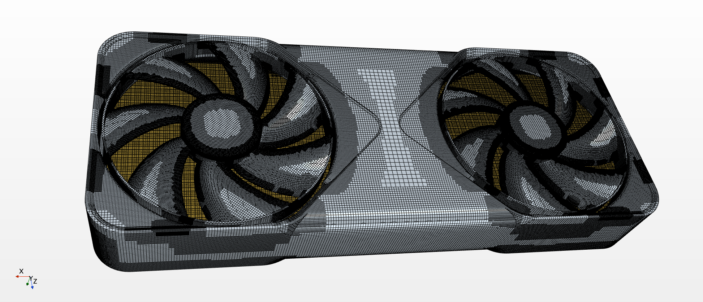

# This is a work in progress!
- I am still working on realistic physics for the PCB/Die/Vapor Chamber to match real world test data.
# 5090-FE-CFD-Simulation
This is a simulation of the Founders Edition 5090 Nvidia GPU:

## Domain and Material Setup

The GPU cooling simulation domain includes the following major components:

| Continua       | Type  | Density (kg/m³) | Specific Heat (J/kg·K) | Thermal Conductivity (W/m·K) | Notes |
|----------------------|-------|------------------|--------------------------|-------------------------------|-------|
| **Fluid Volume**     | Fluid | 1.18 | 1003.62  | 0.026 | Air domain for conjugate heat transfer (CHT) |
| **PCB**              | Solid | 1800.0 | 1100.0 | 0.5 | Represents PCB substrate (low-conductivity composite) |
| **Die**              | Solid | 2330.0 | 700.0  | 130.0 | Silicon die with high thermal conductivity |
| **Vapor Chamber**    | Solid | 8800.0 | 400.0  | Orthotropic: 20,000 (axial and traverse), 1500 (transverse) | vapor chamber with embedded heat pipes |
---
## Domain and Material Setup

The GPU cooling simulation domain includes the following major regions:

| Region / Part | Type | Notes |
|----------------|------|-------|
| **PCB**           | Solid | PCB substrate (low-conductivity composite) |
| **Die**           | Solid | Silicon die (high thermal conductivity) |
| **Vapor Chamber** | Solid | Orthotropic: 12,000 W/m·K (axial and vertical off the Die), 150 W/m·K perpendicular to the heat pipes |
| **Fan 1 / Fan 2** | Overset Region | Rotating meshes with **Rigid Body Motion (RBM)** applied |

### Heat Sink Porous Medium Properties

**Porosity:** 0.667  

**Orthotropic Inertial Resistance:**  
- xx: 10,000.0 kg/m⁴  
- yy: 300.0 kg/m⁴  
- zz: 500.0 kg/m⁴  

**Orthotropic Viscous Resistance:**  
- xx: 10,000.0 kg/m³·s  
- yy: 250.0 kg/m³·s  
- zz: 500.0 kg/m³·s  

**Thermal Conductivity (Orthotropic):**  
- xx: 0.026 W/m·K  
- yy, 237.0 W/m·K  
- zz, 237.0 W/m-k

---
**Case**
- sides set to walls with convection of 25 w/m^2-K
- inlet at the bottom set to mass flow of 0.088 kg/s
- Pressure outlet at the top
---
**Click To Play video on Youtube**
---

- First test run to ensure thermals and fans are spinning
- Flow through porous medium working
- Heat transfer through all mediums working as intended
- Done to ensure all multiphysics is working as intended

💡 **Notes:**
- The conjugate heat transfer (CHT) interface couples the **die, vapor chamber, heat sink, and air** regions.
- Fans are represented as rotating reference frames (MRF) or rigid-body motion (RBM) zones depending on simulation setup (both cases were sim'ed).
- The **heat sink** is treated as a **porous region** to account for detailed fin flow resistance while retaining conjugate heat transfer effects.  
- The vapor chamber is modeled as an orthotropic solid to represent the high in-plane heat spreading provided by the embedded wick and vapor core. In detailed simulations, a true vapor chamber is often represented by a five-layer structure (top cover, top wick, vapor core, bottom wick, and bottom cover) to capture phase-change and capillary effects. For demonstration purposes, this model simplifies the vapor chamber into a single anisotropic solid block with equivalent thermal properties and can be off by as mubh as 10%-15%.

---

## Mesh Setup

Below are views of the GPU simulation mesh:

- This visualization models transient conjugate heat transfer through the RTX 5090 FE under a 600 W thermal load. The GPU die receives 450 W, and the PCB receives 150 W (future project would actually model the memory modules).
- Dual fans are simulated with Rigid Body Motion (RBM) to generate realistic airflow and convection through the porous heat-sink region.
- The simulation captures full heat transfer across the die, vapor chamber, heat sink, and PCB.

## Pressure Analysis

### Static Pressure Results

**Inlet Static Pressure:** ~10 Pa (average)  
**Outlet Static Pressure:** ~-0.4 Pa (average)  
**Pressure Drop:** ΔP ≈ 10.4 Pa

### Static Pressure Interpretation:

The pressure drop across the heatsink assembly is approximately 10.4 Pa, which is relatively low for a GPU cooling solution. This indicates:

- **Low flow resistance** through the fin stack
- **Significant flow bypass** around the porous media
- **Dead zones** with stagnant air contributing to reduced effective flow area

The negative outlet pressure (-0.4 Pa) indicates a slight vacuum condition at the exhaust, typical for pusher fan configurations where air expands into open space after exiting the heatsink.

### Flow Characteristics

- **Volume-averaged velocity through fins:** 0.515 m/s
- **Velocity in active flow regions:** ~1.5 m/s
- **Estimated effective fin utilization:** ~33%

This significant discrepancy between local and average velocities reveals that approximately 2/3 of the fin area experiences poor or stagnant flow, representing a major design inefficiency in the Founders Edition cooling architecture.

## The video below shows the blockage from the dead zone closer to center as well as from the heat pipes:

## Temperature Analysis

### Coolant Temperature Results

**Inlet Temperature:** ~70°C (average)  
**Outlet Temperature:** ~64°C (average)  
**Temperature Change:** ΔT ≈ -6°C (cooling)

### Flow Stagnation and Hot Spots

The counterintuitive temperature drop (inlet hotter than outlet) reveals a critical design flaw in the cooling architecture. This occurs due to:

- **Flow stagnation zones** where air becomes trapped with poor circulation
- **Non-uniform flow distribution** through the porous media
- **Hot pockets** forming in blocked regions (70°C) while main flow paths remain cooler (64°C)

The inlet temperature monitor is capturing air in a stagnant/recirculation zone that has been heated significantly, while the outlet monitor measures the primary flow path where air moves more freely through the fins.

### Porous Media Temperature Distribution

The temperature contour clearly shows:
- **Non-uniform thermal distribution** across the heatsink
- **Hot spots** correlating with dead flow zones
- **Significant temperature gradients** indicating poor flow coupling

With only ~33% of the fin area receiving adequate airflow (1.5 m/s in active regions vs 0.515 m/s average), approximately 2/3 of the heatsink mass is underutilized, creating localized thermal buildup and reducing overall cooling efficiency.

### Design Implications

This represents a fundamental flaw in the Founders Edition cooling design where aesthetic considerations and packaging constraints have created flow bypass paths and stagnation zones, leaving significant cooling performance on the table.

