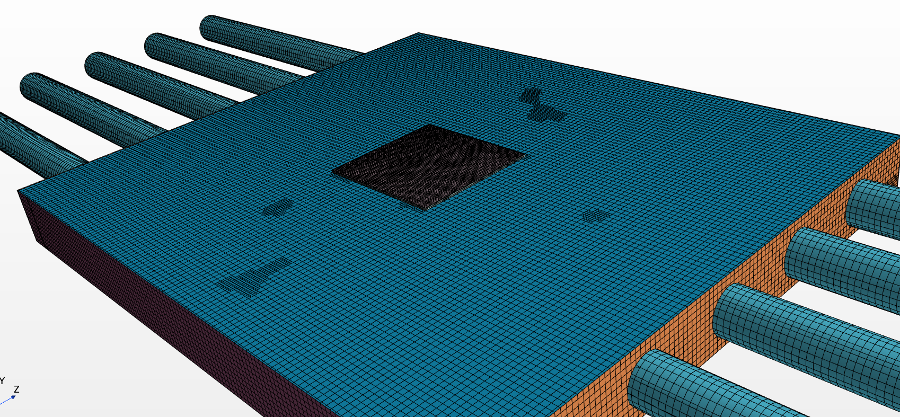

# 5090-FE-CFD-Simulation
This is a simulation of the Founders Edition 5090 Nvidia GPU:

### This is a work in progress!

## Domain and Material Setup

The GPU cooling simulation domain includes the following major components:

| Region / Part        | Type  | Density (kg/m³) | Specific Heat (J/kg·K) | Thermal Conductivity (W/m·K) | Notes |
|----------------------|-------|------------------|--------------------------|-------------------------------|-------|
| **Fluid Volume**     | Fluid | 1.18 | 1003.62  | 0.026 | Air domain for conjugate heat transfer (CHT) |
| **Circuit Board**    | Solid | 1800.0 | 1100.0 | 0.5 | Represents PCB substrate (low-conductivity composite) |
| **Die**              | Solid | 2330.0 | 700.0  | 130.0 | Silicon die with high thermal conductivity |
| **Vapor Chamber**    | Solid | 8800.0 | 400.0  | Orthotropic: 40,000 (axial), 401 (transverse) | Copper vapor chamber with embedded heat pipes |
| **Heat Sink**        | Solid | — | — | — | Aluminum heat sink modeled with detailed fin geometry |

---

💡 **Notes:**
- The vapor chamber is modeled as an **orthotropic solid**, with extremely high thermal conductivity along the pipe direction (40,000 W/m·K) and isotropic transverse conductivity (401 W/m·K).  
- The conjugate heat transfer (CHT) interface couples the **die, vapor chamber, heat sink, and air** regions.
- Fans are represented as rotating reference frames (MRF) or rigid-body motion (RBM) zones depending on simulation setup.

---

## Mesh Setup

Below are views of the GPU simulation mesh:

